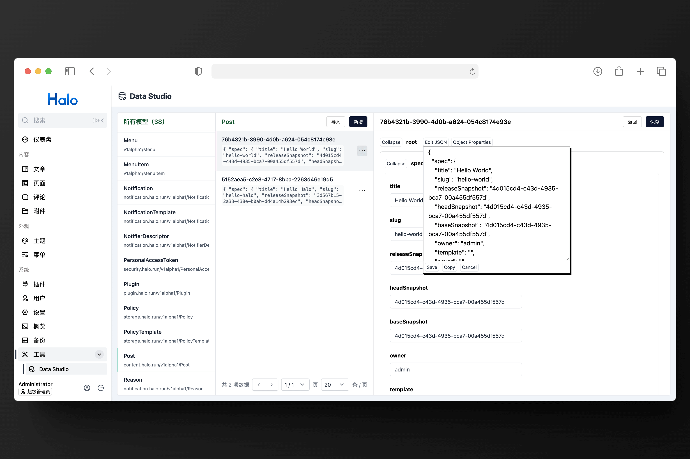

# Data Studio（数据工厂）

Halo 的数据维护插件，支持查询系统内所有模型，以及维护任意模型数据。

## ⚠️ 警告

此功能拥有极高的数据操作灵活度，在进行操作之前请务必熟悉 Halo 的运行机制，避免造成数据异常或者不完整。在进行某些数据修改前也请尽可能提前备份数据。

相关资料：

- [自定义模型设计](https://github.com/halo-dev/rfcs/tree/main/extension)
- [Halo 架构概览](https://docs.halo.run/developer-guide/plugin/basics/framework)

## 特性

- 支持列出系统内所有已加载的模型。
- 支持对模型数据的 CRUD。
- 支持数据的可视化编辑。
- 支持导入导出数据。

## 预览

